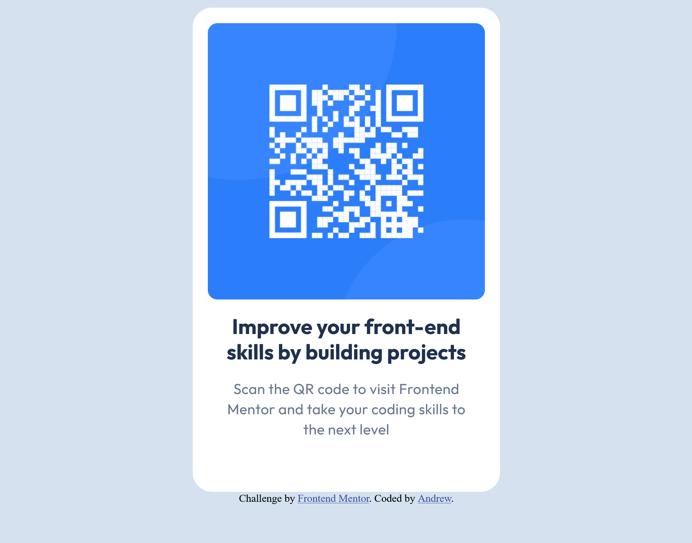

# Frontend Mentor - QR code component solution

This is a solution to the [QR code component challenge on Frontend Mentor](https://www.frontendmentor.io/challenges/qr-code-component-iux_sIO_H). Frontend Mentor challenges help you improve your coding skills by building realistic projects. 

## Table of contents

- [Overview](#overview)
  - [Screenshot](#screenshot)
  - [Links](#links)
- [My process](#my-process)
  - [Built with](#built-with)
- [Author](#author)

**Note: Delete this note and update the table of contents based on what sections you keep.**

## Overview
Centered QR code centered/formatted via flexboxes.

The primary thing I'm least sure about is if there is a better way to handle responsiveness at 320px width for accessibility. Once it gets that tight I'm not sure if it would be better to scale down the size of the card to ensure consistent body background margin to come through. Or is it better to maintain the size of the QR code as the focal point?

### Screenshot

### Links

- Solution URL: [https://github.com/anscmyers/frontendmentor-qrCode/tree/master]
- Live Site URL: [https://animated-zabaione-c79a00.netlify.app/]

## My process

I started with the Figma design
Built out my HTML div structure -- but I had to figure out at what level I needed to Center + apply Flexbox

Then I moved through each place applying CSS to attempt to match the Figma design in Desktop and Mobile sizes!

### Built with

- Semantic HTML5 markup
- CSS custom properties
- Flexbox

## Author

- Frontend Mentor - [@anscmyers]
